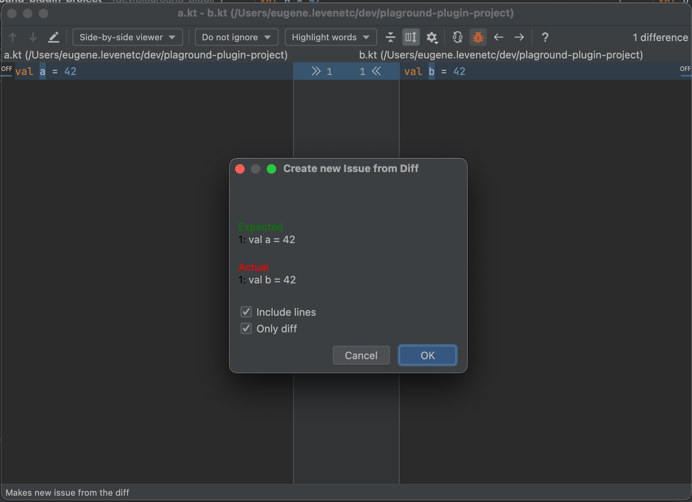
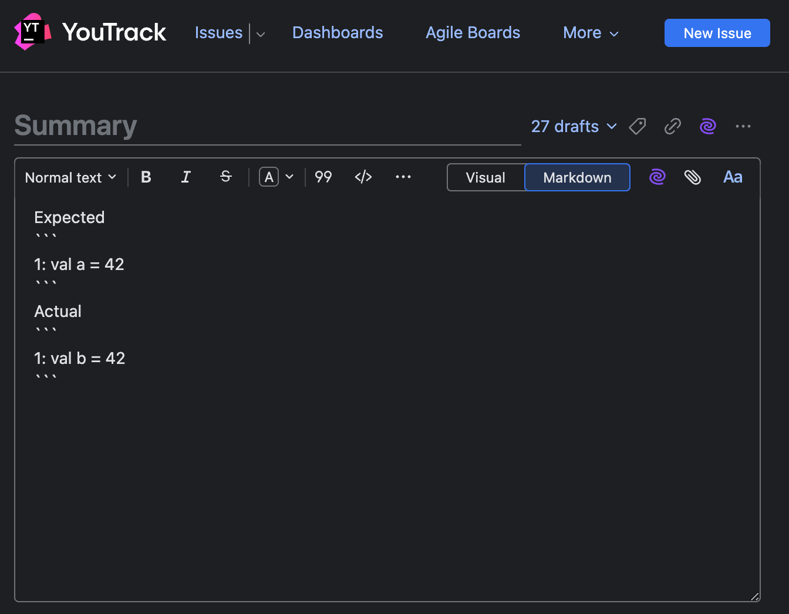

# Diff Issue IJ plugin
Allows to create issue from IJ Diff Viewer without manually copying `expected` and `actual` code fragments.

## Using
1. Open Diff Viewer
2. Press `New issue` button
3. Select options: include lines and/or full diff
4. Press `Ok`
5. Plugin will open browser with issue tracker and your new issue
## Build plugin
1. Checkout repository
2. `./gradlew buildPlugin`
3. Open IJ `Settings` > `Plugin` > `Gear icon` > `Install Plugin from Disk...`
4. Select zip archive with plugin at `build/distributions/diff-issue-plugin-1.0-SNAPSHOT.zip`
## Customization
By default plugin creates `YouTrack` issue. It can be changed in [issue-tracker.config](src/main/resources/issue-tracker.config)